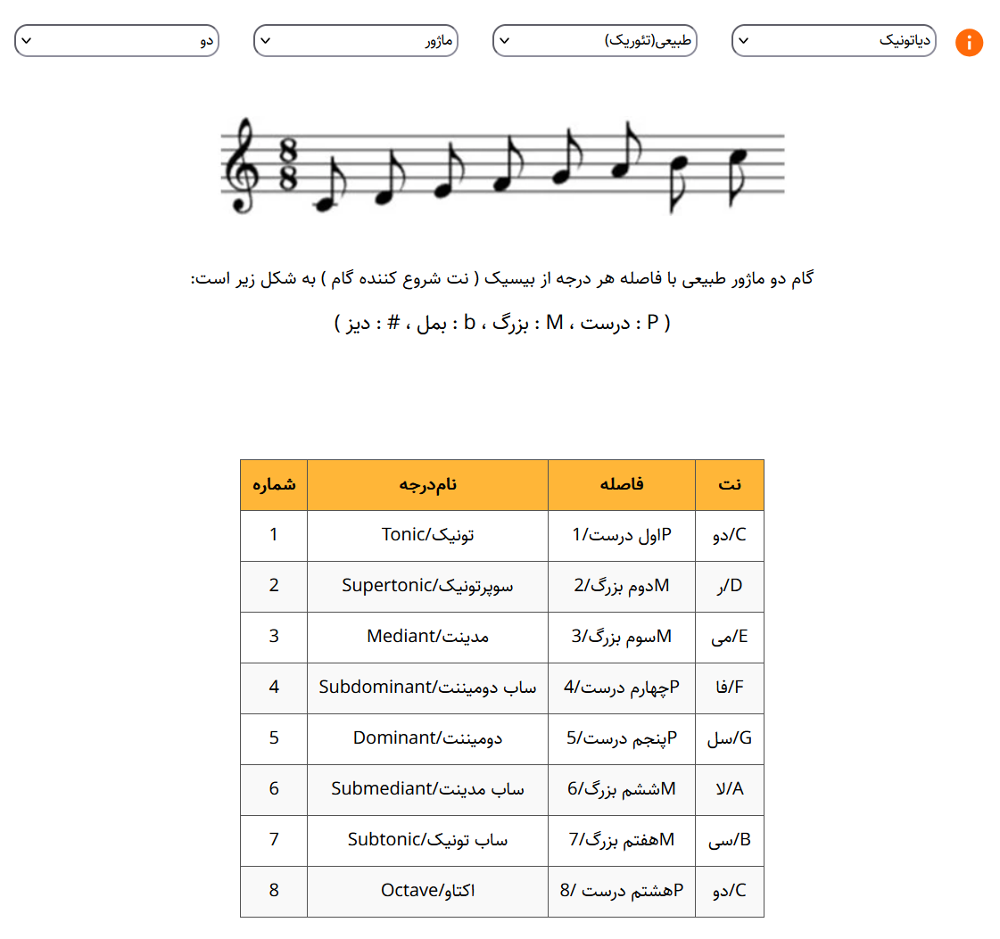
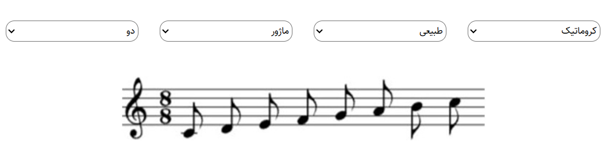
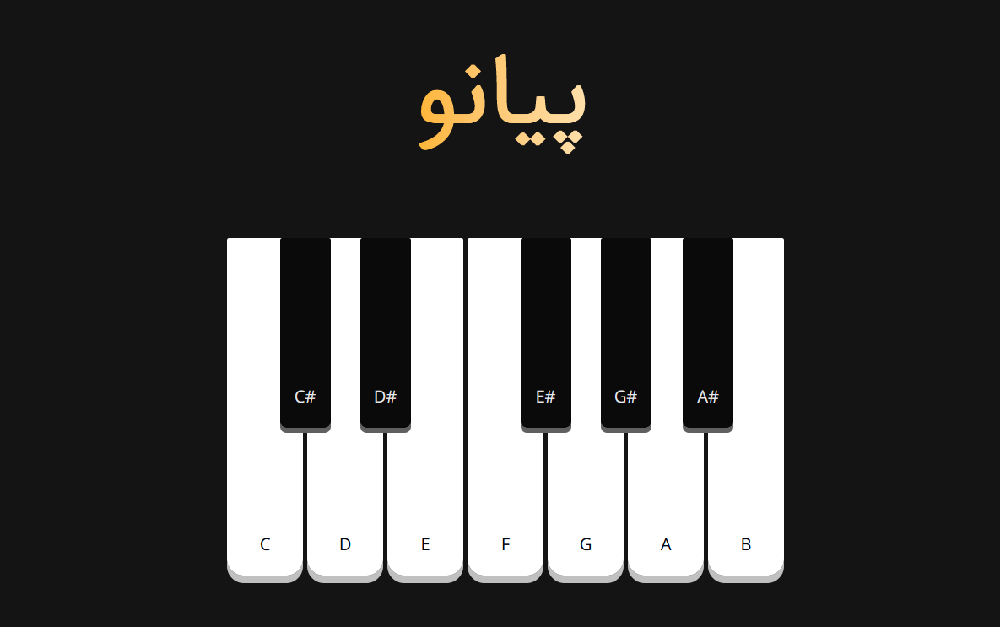

# 🎵 Notopia

A web-based tool for learning music theory concepts — visualize **scales** and **intervals** interactively on a real music staff.

---

## ✨ Features

- 🎼 **Intervals** — Select an interval type (unison, second, third...) and see it rendered on a music staff
- 🪜 **Scales** — Choose a root note and scale type (Major, Natural Minor, Chromatic, and more) to visualize the full scale on a staff
- 🎹 **Piano** — Play a virtual piano with real note sounds, directly in the browser
- 🌐 No installation needed — runs entirely in the browser

---

## 📸 Screenshots

### Intervals

  

### Scales

  

### Piano

  

---

Made with 🧡 for music lovers
